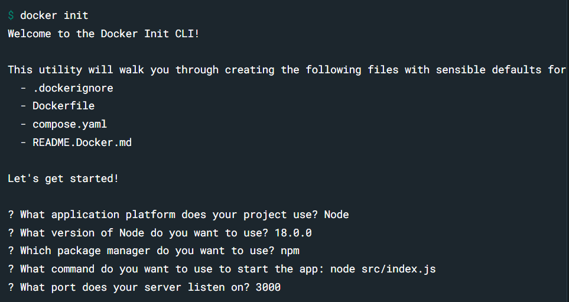

# Installations Schritte Abschlussaufgabe

>### Vorbereitung

- **Docker** auf dem Lokalen Rechener installiert.
- **Git** Installiert und eingerichtet auf dem Lokalen Rechner.

>### Schritte

1. Das Repository Forken
2. Das eigene Repository Lokal speichern
3. README.md anpassen
4. Im Bash `docker init` aus führen ([Anleitung](https://docs.docker.com/guides/nodejs/containerize/))
5. Werte wie im Bild unten angeben

6. Im Bash `docker compose up --build` ausführen
7. Besuche diesen Link [http://localhost:3000/](http://localhost:3000/)
